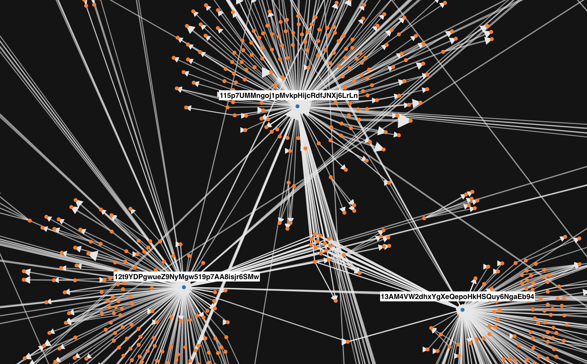

# Bitcoin Visualization 


Part of Hong Kong Data Science Unhackathon series.

With Prashanth, Hari, Claris and Xavier we built the kick-off of a visualisation of the bitcoin blockchain. The transactions stored in each block create a large oriented graph that we wanted to explore in-depth. We focused on a particular ransomware, **WannaCry**, which used bitcoin for money transactions. From the 12 May 2017, infected people transferred around 300USD to 3 particular bitcoin adresses: `115p7UMMngoj1pMvkpHijcRdfJNXj6LrLn`, `12t9YDPgwueZ9NyMgw519p7AA8isjr6SMw` and
`13AM4VW2dhxYgXeQepoHkHSQuy6NgaEb94`. The graph we built provide the tools to understand where to money was coming from and where it went, potentially identifying hackers as the money was withdrawn at some point.

